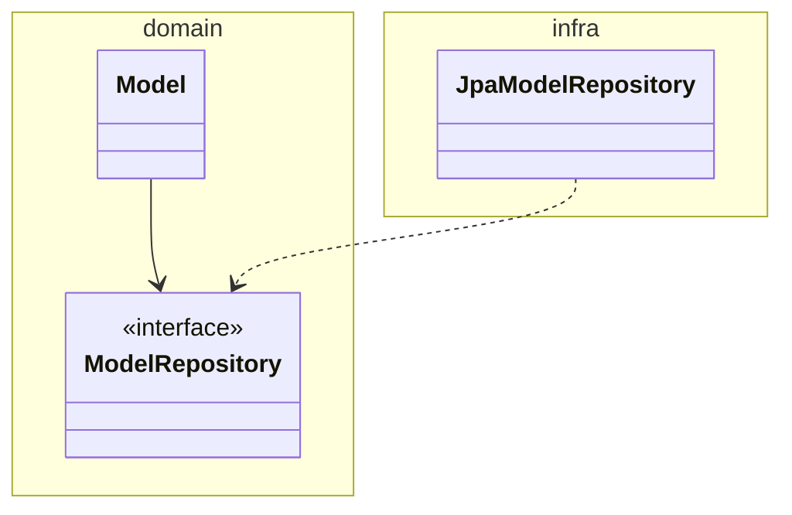
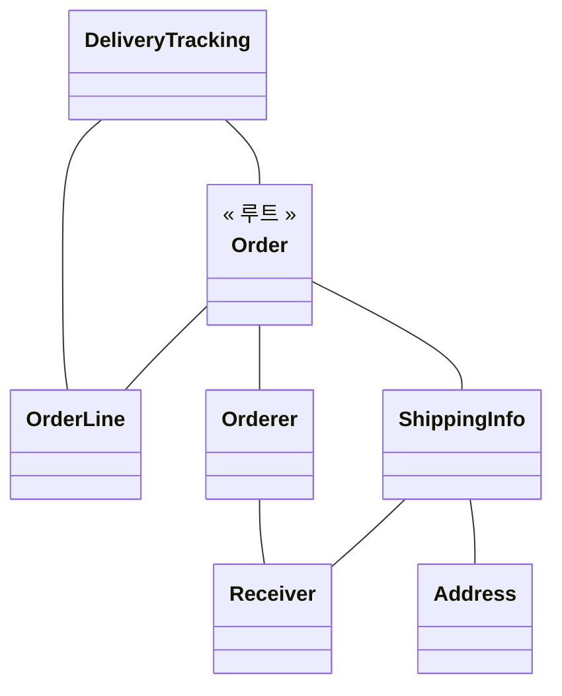
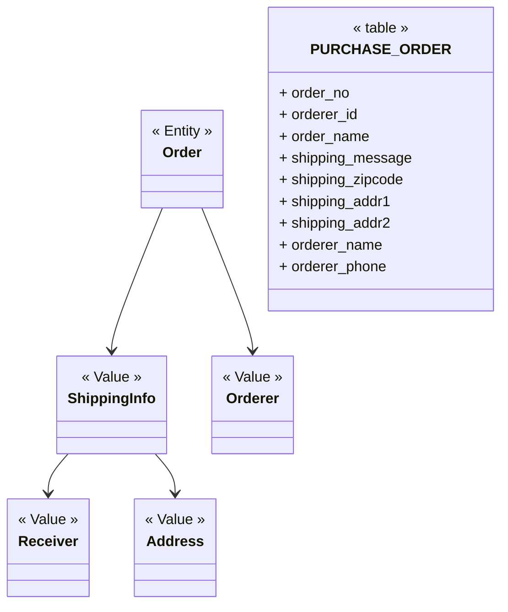
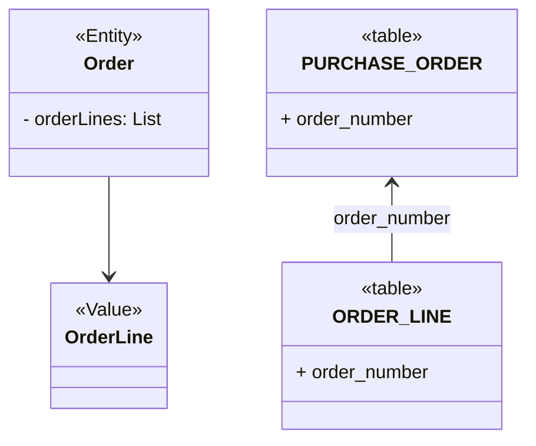
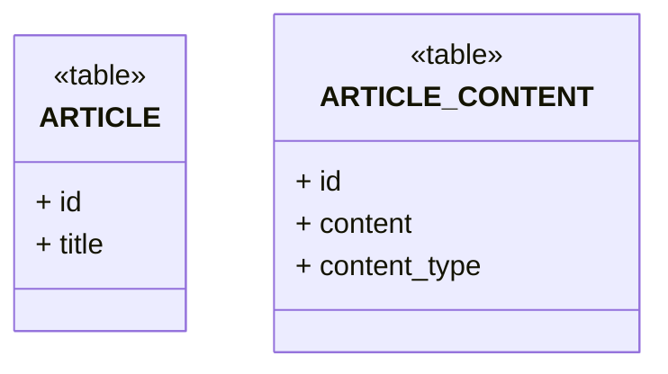

> 04 리포지터리와 모델 구현

<!-- TOC -->
* [4.1 JPA를 이용한 리포지터리 구현](#41-jpa를-이용한-리포지터리-구현)
  * [4.1.1 모듈 위치](#411-모듈-위치)
  * [4.1.2 리포지터리 기본 기능 구현](#412-리포지터리-기본-기능-구현)
    * [리포지터리 기본 기능 2가지](#리포지터리-기본-기능-2가지)
    * [인터페이스는 애그리거트 루트를 기준으로 작성](#인터페이스는-애그리거트-루트를-기준으로-작성)
* [4.2 스프링 데이터 JPA를 이용한 리포지터리 구현](#42-스프링-데이터-jpa를-이용한-리포지터리-구현)
* [4.3 매핑 구현](#43-매핑-구현)
  * [4.3.1 엔티티와 밸류 기본 매핑 구현](#431-엔티티와-밸류-기본-매핑-구현)
    * [주문 애그리거트 예시](#주문-애그리거트-예시)
  * [4.3.2 기본 생성자](#432-기본-생성자)
  * [4.3.3 필드 접근 방식 사용](#433-필드-접근-방식-사용)
  * [4.3.4 AttributeConverter를 이용한 밸류 매핑 처리](#434-attributeconverter를-이용한-밸류-매핑-처리)
  * [4.3.5 밸류 컬렉션: 별도 테이블 매핑](#435-밸류-컬렉션-별도-테이블-매핑)
  * [4.3.6 밸류 컬렉션: 한 개 컬럼 매핑](#436-밸류-컬렉션-한-개-컬럼-매핑)
  * [4.3.7 밸류를 이용한 ID 매핑](#437-밸류를-이용한-id-매핑)
    * [밸류 타입 식별자 장점: 식별자에 기능 추가 가능](#밸류-타입-식별자-장점-식별자에-기능-추가-가능)
  * [4.3.8 별도 테이블에 저장하는 밸류 매핑](#438-별도-테이블에-저장하는-밸류-매핑)
    * [별도 테이블에 저장한다고해서 엔티티는 아니다](#별도-테이블에-저장한다고해서-엔티티는-아니다)
    * [애그리거트와 밸류의 구분](#애그리거트와-밸류의-구분)
  * [4.3.9 밸류 컬렉션을 @Entity로 매핑하기](#439-밸류-컬렉션을-entity로-매핑하기)
  * [4.3.10 ID 참조와 조인 테이블을 이용한 단방향 M-N 매핑](#4310-id-참조와-조인-테이블을-이용한-단방향-m-n-매핑)
* [4.4 애그리거트 로딩 전략](#44-애그리거트-로딩-전략)
* [4.5 애그리거트의 영속성 전파](#45-애그리거트의-영속성-전파)
* [4.6 식별자 생성 기능](#46-식별자-생성-기능)
* [4.7 도메인 구현과 DIP](#47-도메인-구현과-dip)
    * [DIP를 사용하는 주된 이유](#dip를-사용하는-주된-이유)
<!-- TOC -->

# 4.1 JPA를 이용한 리포지터리 구현

> JPA를 이용해서 리포지터리와 애그리거트를 구현하는 방법에 대해 다룬다.

## 4.1.1 모듈 위치



- 도메인  
  - 모델
  - 리포지터리
- 인프라
  - 리포지터리를 구현한 클래스
    - 가능하면 리포지터리 구현 클래스는 인프라 영역에 위치 시켜서 인프라에 대한 의존을 낮춰야한다.


## 4.1.2 리포지터리 기본 기능 구현

### 리포지터리 기본 기능 2가지

1. ID로 애그리거트 조회
2. 애그리거트 저장

```java
public interface OrderRepository {
    Order findById(OrderId orderId);
    void save(Order order);
}
```

### 인터페이스는 애그리거트 루트를 기준으로 작성




- 주문 애그리거는 Order 루트 엔티티외에 OrderLine 등 다양한 객체 포함.
- 이 중 루트 엔티티인 Order를 기준으로 리포지터리 인터페이스 작성.

# 4.2 스프링 데이터 JPA를 이용한 리포지터리 구현

# 4.3 매핑 구현

## 4.3.1 엔티티와 밸류 기본 매핑 구현

- 애그리거트 루트는 엔티티이므로 `@Entity`로 매핑 설정.
- 밸류는 `@Embeddable`로 매핑 설정.
  - 밸류 타입 프로퍼티는 `@Embedded`로 매핑 설정.

### 주문 애그리거트 예시




- 루트 엔티티: Order
- 밸류: ShippingInfo, Orderer
- 위 세 객체와 ShippingInfo에 포함된 Address, Receiver 객체는 한 테이블에 매핑 가능.


## 4.3.2 기본 생성자

## 4.3.3 필드 접근 방식 사용

## 4.3.4 AttributeConverter를 이용한 밸류 매핑 처리

## 4.3.5 밸류 컬렉션: 별도 테이블 매핑




## 4.3.6 밸류 컬렉션: 한 개 컬럼 매핑

- 이메일 주소 목록을 Set으로 보관, DB에는 한 개 컬럼에 콤마로 저장하는 경우

## 4.3.7 밸류를 이용한 ID 매핑

- `@EmbeddedId` 사용
- JPA에서 식별자 타입은 Serializable 타입이어야하므로, 식별자로 사용할 밸류 타입은 `Serializable` 인터페이스를 상속받아야함.

### 밸류 타입 식별자 장점: 식별자에 기능 추가 가능

## 4.3.8 별도 테이블에 저장하는 밸류 매핑

### 별도 테이블에 저장한다고해서 엔티티는 아니다

- 애그리거트에서 루트 엔티티를 뺀 나머지는 대부분 밸류.
- 별도 테이블에 데이터 저장한다고 해서 엔티티인 것은 아니다.
  - 주문 애그리거트도 OrderLine을 별도 테이블에 저장하지만, OrderLine 자체는 엔티티가 아니라 밸류이다.

### 애그리거트와 밸류의 구분



- 고유 식별자를 갖는 것이 엔티티
- 매핑되는 테이블의 식별자를 애그리거트 구성요소의 식별자와 같은 것으로 착각하지 말자.

## 4.3.9 밸류 컬렉션을 @Entity로 매핑하기

## 4.3.10 ID 참조와 조인 테이블을 이용한 단방향 M-N 매핑

# 4.4 애그리거트 로딩 전략

- 상태 변경 기능을 실행하기 위해 조회 시점에 즉시 로딩을 이용해서 애그리거트를 완전한 상태로 로딩할 필요는 없다.
- 실제로 상태를 변경하는 시점에 필요한 구성요소만 로딩해도 문제되지 않음.

# 4.5 애그리거트의 영속성 전파

# 4.6 식별자 생성 기능

# 4.7 도메인 구현과 DIP

```java
@Entity
public class Article {
  @Id
  @GeneratedValue(strategy = GenerationType.IDENTITY)
  private Long id;
}
```

- 도메인이 특정 기술인 인프라에 의존하고 있다.

### DIP를 사용하는 주된 이유

- 저수준 구현이 변경되어도 고수준이 영향 받지 않게 하는 것이 DIP 목적.
 - 그러나, **_리포지터리와 도메인 모델의 구현 기술은 거의 바뀌지 않는다.!!_**
   - JPA로 구현한 리포지터리 구현 기술을 마이바티스로 바꾼 적이 없다!
   - RDBMS를 사용하다가 몽고 DB로 바꾼 적도 없다!
- **_변경이 거의 없는 상황에서 변경을 미리 대비하는 것은 너무 과하다!!_** 
